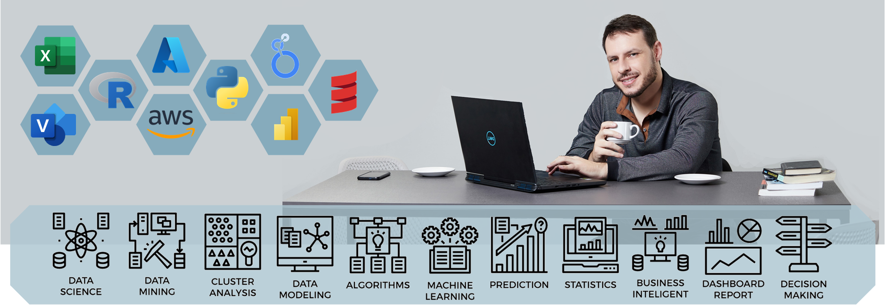

# Welcome to My GitHub Repository!

## About Me

Hello! My name is Nion and I'm passionate about data. I am a proficient programmer with a solid background in R, Python, and data science as a whole. This is the place where I share my projects and showcase my skills in data modeling, data mining, algorithms, machine learning, prediction, statistics, business intelligence, dashboard reporting, and decision making.

## Interests and Expertise
My interest lies in understanding the power of data and leveraging it to extract valuable insights, make predictions, and drive decision making in a business context. I am highly skilled in:

- **Data Science:** Using programming languages like R and Python, I'm able to handle, manipulate and analyze complex datasets. I am adept at creating sophisticated data models and using advanced algorithms.

- **Machine Learning:** I have a deep understanding of a variety of machine learning algorithms, from the most basic to the state-of-the-art. This knowledge allows me to create predictive models and contribute to the advancement of AI.

- **Statistics:** My strong foundation in statistics allows me to correctly apply statistical tests, build statistical models, and interpret their results, thus deriving meaningful conclusions from data.

- **Data Mining:** Using my data mining skills, I can uncover patterns, correlations, and trends that might otherwise go unnoticed, bringing new opportunities and insights to light.

- **Business Intelligence:** I believe that data should serve strategic business purposes. Therefore, I am experienced in using BI tools and strategies to

## Contact Me
I'm always excited to collaborate on data science projects or answer any questions you may have. Feel free to reach out to me via email or connect with me on [LinkedIn](https://www.linkedin.com/in/nionmaron/).

